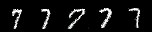
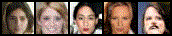
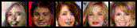
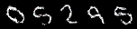
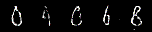

# Infogan

This project is an implementation of the paper infoGAN using Pytorch Lightning.

## Setup
```
git clone https://github.com/mohith-sakthivel/infogan-pytorch.git infogan_pl
cd infogan_pl

conda env create -f environment.yml
conda activate infogan_pl
```

## Run
To train the model on MNIST dataset , use
```
python -m infogan.infogan_module --dataset mnist --max_epochs 50
```
### Arguments:
    dataset     - Dataset to train on. Configured datasets are MNIST (use 'mnist') and CelebA (use 'celeba').
    batch_size  - Batch size to use for training
    datadir     - Directory to log data
    gpus        - Number of GPUs to use
    num_workers - Number of workers for loading data
    max_epochs  - Maximum number of training epochs

#### Note:
- CelebA dataset has to be downloaded and placed in the desired directory manually. This is due to a bug in the torchvision package.

## Learnt Latent factors
InfoGAN can learn meaningul disentangled features in an unsupervised fashion. The following figures illustrate the high level image features captured by the latent factors when trained on the MNIST and celebA datasets.

For the MNIST dataset, the code is sampled from a uniform categorical distribution with 10 classes and a gaussian distrbution with 2 independent random variables. For the celebA dataset, the code comprises of 10 categorical distriubtions with 10 classes each. 

### Categorical Latents
- The follwing figures show the variation in the generated images with each class of the categorical distribution.
- For the MNIST dataset, the categorical latents captures the 10 digit classes

<p align="center" >
  <br>
</p>

- For the celebA dataset, the latents capture features like gender, hair length, hair colour, etc.

<p align="center" >
  <br>
</p>

<p align="center" >
  <br>
</p>

<p align="center" >
  <br>
</p>

### Gaussian Latents
- The follwing figures show the variation in the generated images when a single gaussian variable is gradually changed from -4 to +4.

- One of the gaussian latent code captures the orientation (or) slant of the digit

<p align="center" >
  
</p>

- The other gaussian latent code learns to capture the thickness of the text

<p align="center" >
  
</p>


## References
1. X Chen, Y Duan, R Houthooft, J Schulman, I Sutskever, P Abbeel - InfoGAN: Interpretable Representation Learning by Information Maximizing Generative Adversarial Nets, NeurIPS 2016. ([paper](https://arxiv.org/abs/1606.03657))
2. T Miyato, T Kataoka, M Koyama, Y Yoshida - Spectral Normalization for Generative Adverserial Networks, ICLR 2018. ([paper](https://arxiv.org/abs/1802.05957))
3. A Radford, L Metz, S Chintala - Unsupervised Representation Learning with Deep Convolutional Generative Adversarial Networks, ICLR 2016. ([paper](https://arxiv.org/abs/1511.06434))


